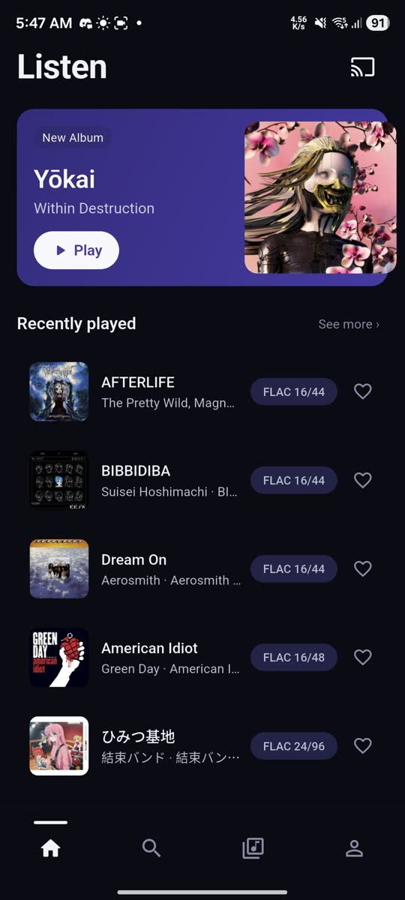
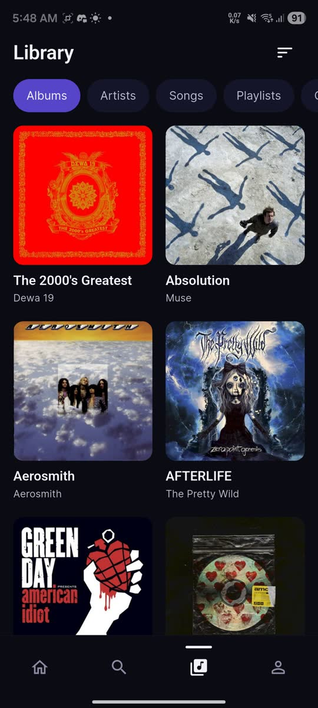
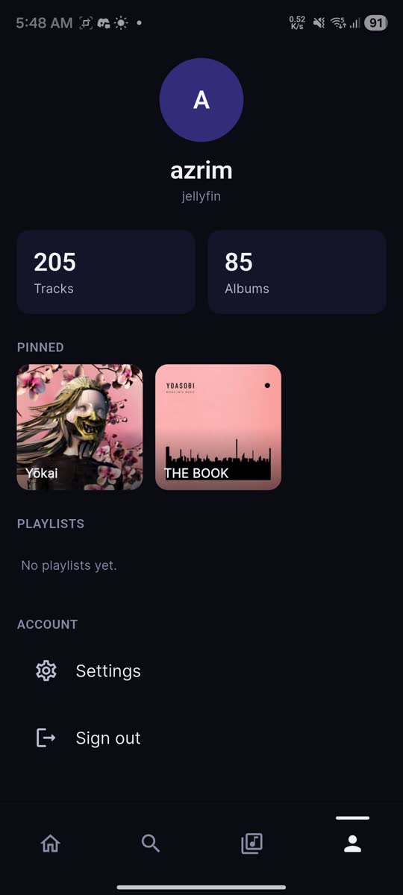
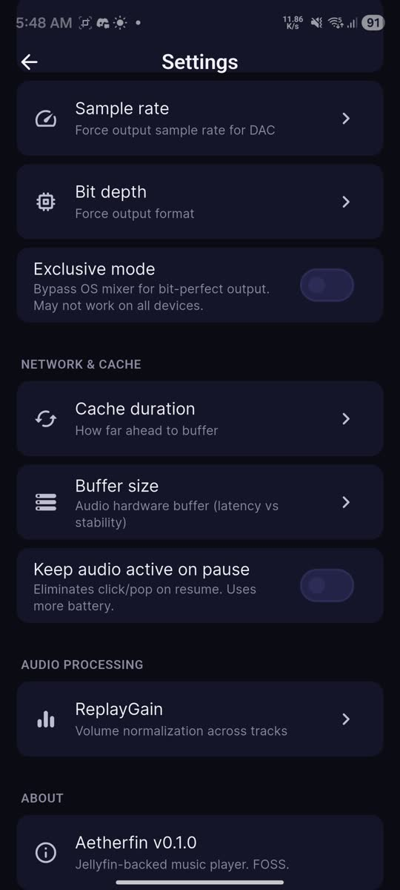

<p align="center">
  
</p>

<p align="center">
  <strong>Your music. Your server. No compromises.</strong>
</p>

<p align="center">
  <a href="https://flutter.dev"></a>
  <a href="./LICENSE"></a>
  <a href="https://developer.android.com"></a>
  <a href="https://github.com/Aetherfin/mobile-app/releases"></a>
</p>

<p align="center">
  Native Android music player for <a href="https://jellyfin.org">Jellyfin</a>, <a href="https://www.navidrome.org">Navidrome</a>, and local files.<br>
  Streams your library. Decodes on-device with libmpv. Stays out of your way.
</p>

<p align="center">
  <em>No cloud. No telemetry. No transcoding. Just playback.</em>
</p>

---

## See it in action

<p align="center">
  
  
  
  
</p>

<details>
<summary><strong>▶ Watch demo video</strong></summary>
<br>
<video src="docs/assets/screencapture/demo.mp4" poster="docs/assets/screencapture/demo-poster.jpg" controls width="100%"></video>
</details>

---

## Why Aetherfin

| | |
|---|---|
| **Direct stream** | Raw bytes from your server. No HLS, no transcoding, no quality loss. |
| **Lossless** | FLAC, ALAC, OPUS, WAV — whatever your library has. |
| **Full DSP** | 86-effect rack: 18-band EQ, compressor, pitch shift, and [more](#audio). |
| **Offline-ready** | No "Aetherfin cloud." Your server, your phone, done. |
| **Visualizer** | 64-band FFT driven by actual audio output. No mic permission. |

---

## Features

### Playback
Gapless transitions · Shuffle / loop / forNtimes repeat · Lock-screen & notification controls · Sleep timer · A-B loop · **Smart Queue Autoplay** (local similarity engine + server mixes) · Instant playback on large queues · Shuffle next · Queue history · M3U export/import · Android home screen widget · Synced lyrics (LRC) · Auto-pause on headphone/Bluetooth disconnect with 5-min auto-resume

### Audio
86-effect DSP via mpv's ffmpeg pipeline — 18-band graphic EQ with presets · Echo/delay · Phaser · Flanger · Chorus · Tremolo · Vibrato · Bit-crusher · Dynamic compressor · Noise gate · De-esser · EBU R128 loudness normalization · ReplayGain · Pitch & tempo shifting (rubberband) · Crossfeed · Stereo widening · Virtual bass · Harmonic exciter · Master bypass

### Library & Home
Albums, Artists, Songs, Playlists, Genres, Liked songs · Smart playlists (rule-based, server + local) · Search · Context menus · Drag-to-reorder queue · Swipe-to-remove · Playlist undo (8s grace) · Navidrome queue sync (JWT) · Hero album carousel · Recently played sections

### Now Playing
FFT visualizer (64 bars, 60 fps) · Gradient background from artwork palette · Artwork pulse on kick drums · Synced lyrics · Favorite toggle · Quality chip · Translucent frosted-glass queue · Interactive drag-down sheet

### Last.fm (Optional)
Two-way favorite sync · Listening stats dashboard (top songs/artists/albums) · Artist & track similar radio · Wikipedia-style bios · Browser-based OAuth connection

### UI/UX
Lucide icons throughout · Skeleton shimmer loading · Filter pills for songs · Dialog-based context menus

---

## Install

Grab the latest APK from **[Releases](https://github.com/Aetherfin/mobile-app/releases)**.

**Requirements:** Android 7.0+ · A [Jellyfin 10.8+](https://jellyfin.org/downloads/server) or [Navidrome 0.49+](https://www.navidrome.org/docs/installation/) server (or local audio files)

**First run:**
1. Choose **Server** or **Local** mode
2. Enter your server URL + sign in, or pick a music folder
3. Play something

---

## Build from source

> First build downloads ~20MB libmpv `.so` files per ABI from GitHub Releases.

```bash
flutter pub get
flutter run --debug          # Debug
flutter build apk --release  # Release
```

Before pushing:
```bash
flutter analyze && flutter test
```

---

## How it works

```
┌─────────────────────────────┐       ┌────────────────────────────┐
│  Aetherfin (your phone)     │       │  Your server               │
│                             │       │  (Jellyfin or Navidrome)   │
│  libmpv decoding            │◄─raw──┤  Audio files               │
│  Queue, shuffle, gapless    │       │  Metadata, artwork         │
│  FFT visualizer (post-DSP)  │◄─meta─┤  Favorites, playlists     │
│  Lyrics parsing + sync      │       │  Play counts               │
│  DSP effects chain          │       │                            │
│  Cover art cache            │       │                            │
└─────────────────────────────┘       └────────────────────────────┘
```

The server stores files and metadata. Aetherfin does everything else.

---

## Contributing

PRs welcome. Read **[CLAUDE.md](./CLAUDE.md)** first — it covers architecture, design tokens, and the rules.

## Privacy

No analytics. No ads. No trackers. No Aetherfin servers. The app talks only to the server you configure. See [PRIVACY.md](./PRIVACY.md).

## Community

[](https://t.me/azrim_ci)

## License

MIT · [LICENSE](./LICENSE)

## Acknowledgements

[Jellyfin](https://jellyfin.org) · [Navidrome](https://www.navidrome.org) · [mpv_audio_kit](https://pub.dev/packages/mpv_audio_kit) · [Finamp](https://github.com/jmshrv/finamp)
